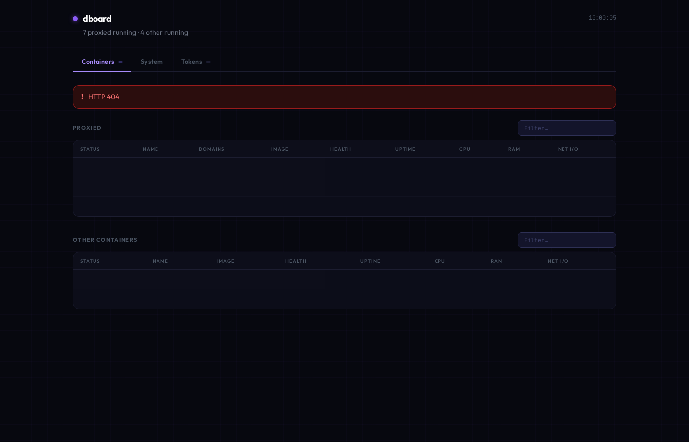
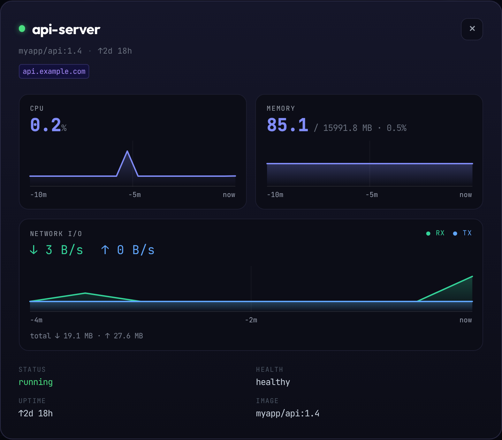
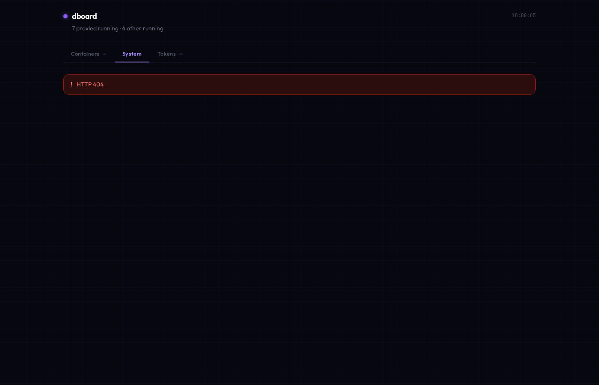
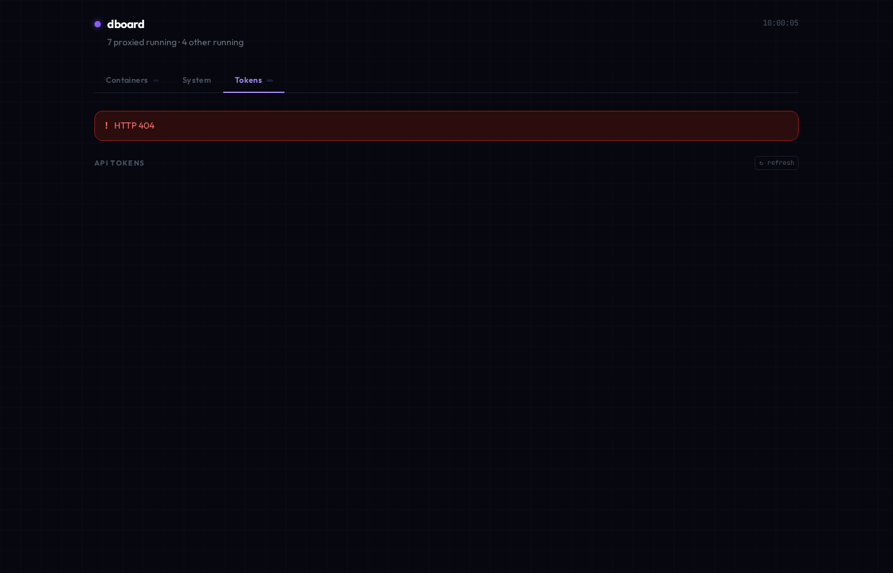

#  dboard

A lightweight, self-hosted Docker infrastructure dashboard.  
Monitors containers, host system metrics, and API token validity — all in one place.

[](https://github.com/kozliatko/dboard/actions/workflows/build.yml)


---

## Screenshots

**Containers** — sortable/filterable tables with live CPU, RAM, net I/O and per-column sparklines:


**Container detail** — click any row for a larger view: live CPU, memory and network-rate charts with a time axis:


**System** — host metrics with SVG sparklines and warn/crit thresholds:


**Tokens** — API key validation without exposing raw values:


---

## Features

- **Three-tab UI** — Containers, System, Tokens
- **Container tables** — sortable and filterable; shows status, health, uptime, CPU, RAM, network I/O with per-column sparklines
- **Global stacked chart** — at the top of the Containers tab: per-container CPU / memory / network usage stacked over time, with metric and range (10m / 1h / 6h / 24h) toggles
- **Container detail overlay** — click any row for a larger view: live CPU, memory and network-rate area charts with a time axis, a selectable range (live / 1h / 6h / 24h, from SQLite history), plus metadata
- **System panel** — live CPU, RAM, swap, disk, network I/O, disk I/O rates with SVG sparklines and visual thresholds (warn/crit); click any card for a detail overlay with larger charts and a selectable range (live / 1h / 6h / 24h)
- **API token validation** — checks key validity without exposing the raw key value; shows service metadata (rate limits, model lists, account info)
- **SQLite persistence** — sparkline history survives restarts; 24-hour retention; optional background sampling records history even when no dashboard is open
- **Hardened by default** — read-only Docker API proxy, non-root container, HTTP Basic Auth, strict CSP, no third-party runtime JS
- **Installable PWA** — app-shell service worker; the UI loads instantly and works offline, while metrics are always fetched live
- **HEALTHCHECK** — built-in Docker healthcheck on `/`

---

## Requirements

- Docker + Docker Compose
- [caddy-docker-proxy](https://github.com/lucaslorentz/caddy-docker-proxy) running with the shared `caddy` network

---

## Quick start

```bash
cp .env.example .env
# Optionally fill in API keys for token validation

# Set the hostname and a Basic Auth password in docker-compose.yml:
#   labels.caddy: your-domain.example.com
#   labels.caddy.basic_auth.admin: "<hash>"
# Generate the hash with (note: double every '$' to '$$' in compose):
docker exec caddy caddy hash-password --plaintext 'choose-a-strong-password'

docker compose up -d
```

The dashboard is served at `https://<your-domain>/` (default in this repo:
`https://dboard.kozliatko.sk/`) and is gated by HTTP Basic Auth.

> **Routing** is handled by [caddy-docker-proxy](https://github.com/lucaslorentz/caddy-docker-proxy)
> labels — no manual Caddy config and no Caddy admin-API manipulation.

---

## Configuration

### Environment variables

All variables are optional. Leave any blank to disable that token check.

| Variable | Description |
|---|---|
| `SAMPLE_INTERVAL` | Background metrics sampling cadence in seconds. `30` (default) records history continuously even with no dashboard open; `0` samples on demand only (no idle load). |
| `ANTHROPIC_API_KEY` | Anthropic API key |
| `GITHUB_TOKEN` | GitHub personal access token |
| `GITLAB_TOKEN` | GitLab personal access token |
| `GITLAB_HOST` | GitLab instance hostname (default: `gitlab.com`) |
| `GEMINI_API_KEY` | Google Gemini API key |
| `OPENAI_API_KEY` | OpenAI API key |
| `DEEPSEEK_API_KEY` | DeepSeek API key |
| `TAVILY_API_KEY` | Tavily search API key |

Copy `.env.example` to `.env` and populate the keys you want validated.

### Volumes

dboard itself mounts **no Docker socket** and **not the host root**. The Docker
API is reached read-only through a separate `socket-proxy` service, and only
narrow, non-sensitive directories are exposed for disk stats.

| Mount | On | Purpose |
|---|---|---|
| `/var/run/docker.sock:ro` | `socket-proxy` | Docker API — proxied read-only, writes blocked |
| `/opt/dboard/diskprobe:/host/root:ro` | `dboard` | Empty dir on the `/` filesystem → `statvfs` reports `/` usage without exposing any files |
| `/boot:/host/boot:ro` | `dboard` | `/boot` filesystem usage |
| `dboard_data:/app/data` | `dboard` | SQLite history (writable, owned by the non-root app user) |

Create the probe directory once on the host: `sudo mkdir -p /opt/dboard/diskprobe`.

### Disk monitoring

#### How it works

`statvfs()` returns usage for the **whole filesystem** a path lives on, not for
the directory itself. dboard exploits this: instead of mounting a sensitive tree
to read its usage, it mounts an **empty directory that merely sits on the target
filesystem**. The numbers are identical to `df`, but no files are exposed.

```
host:  /opt/dboard/diskprobe   (empty, but located on the "/" filesystem)
                 │  bind mount, read-only
                 ▼
container:  /host/root         statvfs() → usage of the entire "/" filesystem
```

`/boot` is mounted directly (it holds only kernel images — nothing sensitive),
while `/` is read through an empty probe dir so the host root is never exposed.

#### Monitoring an additional separate disk

Say the host has a separate data disk mounted at `/mnt/data`. To add it:

1. **Pick what to mount.** If the mountpoint itself is non-sensitive, mount it
   directly. Otherwise create an empty probe dir **on that filesystem**:

   ```bash
   sudo mkdir -p /mnt/data/.dboard-probe
   ```

2. **Add a read-only mount** under the `dboard` service in `docker-compose.yml`:

   ```yaml
       volumes:
         # ... existing mounts ...
         - /mnt/data/.dboard-probe:/host/data:ro   # empty probe → /mnt/data usage
         # or, if the mountpoint is safe to expose:
         # - /mnt/data:/host/data:ro
   ```

3. **Register the probe** in `_DISK_PROBES` in `app/main.py` — `(path inside the
   container, label to display)`:

   ```python
   _DISK_PROBES = [
       ("/host/root", "/"),
       ("/host/boot", "/boot"),
       ("/host/data", "/mnt/data"),   # ← added
   ]
   ```

4. **Recreate the container:** `docker compose up -d`.

The new filesystem appears as its own card in the System tab. Each filesystem is
de-duplicated by device ID, so probing two paths on the same disk reports it
once.

---

## API

| Endpoint | Description |
|---|---|
| `GET /` | Dashboard HTML |
| `GET /api/containers` | All containers with live stats and sparkline history |
| `GET /api/history?name=<c>&range=<seconds>` | Downsampled CPU/mem/net history for one container, from SQLite (up to 24h) |
| `GET /api/stack?metric=cpu\|mem\|net&range=<seconds>` | Per-container series aligned to common time buckets, for the stacked chart (top 8 + `other`) |
| `GET /api/system` | Host metrics + sparkline ring buffers |
| `GET /api/system-history?range=<seconds>` | Downsampled host CPU/mem/temp/net/disk-I/O history, from SQLite (up to 24h) |
| `GET /api/tokens` | Token validation results (5-min cache) |
| `GET /api/tokens?refresh=true` | Force re-validation of all tokens |

---

## Tabs

### Containers

Two tables: **Proxied** (containers with Caddy labels, shown with domain links) and **Others** (all remaining containers).

Both tables support:
- **Sort** by any column (click header, click again to reverse)
- **Filter** by name, image, status, health, or domain
- **Per-row color coding** — orange left border at ≥75% resource usage, red background at ≥90%
- **Sparklines** in CPU and RAM columns (last ~100 s of history)

### System

Live host metrics refreshed every 5 seconds. Each stat card shows:
- Current value and percentage bar
- SVG sparkline of the last ~3 minutes
- Warning (orange border) and critical (red pulsing border) thresholds

| Metric | Warn | Crit |
|---|---|---|
| CPU | ≥ 70% | ≥ 90% |
| RAM | ≥ 80% | ≥ 92% |
| Disk | ≥ 80% | ≥ 92% |
| CPU Temp | ≥ 70 °C | ≥ 85 °C |

Network I/O and Disk I/O cards show dual-line sparklines (read vs. write / rx vs. tx).

CPU temperature is shown if the host exposes temperature sensors (`coretemp`, `k10temp`, `acpitz`, or similar).

### Tokens

Validates each configured API key on page load and caches results for 5 minutes.  
A **↻ refresh** button forces immediate re-validation.

Each card shows:
- Green / red status dot
- Key hint in the form `first4chars···last4chars` — the actual key is never rendered
- Service-specific metadata:
  - **Anthropic** — model count, latest model names, request rate limit
  - **GitHub** — username, repo counts, OAuth scopes, expiry, rate limit
  - **GitLab** — host, username, token name, scopes, expiry, last used
  - **Gemini** — model count, Gemini model names
  - **OpenAI** — model count, GPT model names
  - **DeepSeek** — model names, account balance
  - **Tavily** — search API response time

---

## Architecture

```
browser
  │  HTTPS + Basic Auth
  ▼
Caddy (caddy-docker-proxy)
  └── dboard.kozliatko.sk → reverse_proxy dboard:8000   (basic_auth, via labels)
        │  (every 5 s)
        ├── GET /api/containers  ─┐
        ├── GET /api/system       │
        └── GET /api/tokens       │
                                  ▼
FastAPI (uvicorn, port 8000, non-root, read-only rootfs)
  ├── ThreadPoolExecutor  — blocking docker/psutil/urllib calls
  ├── Background task     — SQLite pruner every 1 h
  ├── Background task     — metrics sampler every SAMPLE_INTERVAL s (optional)
  ├── Docker SDK ─────────► socket-proxy (tcp:2375) ──► docker.sock  (GET only, POST blocked)
  ├── psutil              — CPU/RAM/disk/net/temp
  ├── urllib.request      — external token APIs (cached 5 min)
  └── SQLite (WAL)        — /app/data/metrics.db
          ├── sys_metrics        (one row per /api/system call)
          └── container_metrics  (one row × container per /api/containers call)
```

### Tech stack

| Layer | Technology |
|---|---|
| Backend | Python 3.12, FastAPI, uvicorn |
| Templating | Jinja2 |
| System metrics | psutil |
| Container metrics | Docker SDK for Python |
| HTTP (token checks) | `urllib.request` (stdlib, no extra deps) |
| Database | SQLite 3 (stdlib), WAL mode |
| Frontend | Vanilla JS (external `app.js`), Tailwind CSS (self-hosted, built at image time) |
| Docker API | Read-only via `tecnativa/docker-socket-proxy` |
| Fonts | Outfit, JetBrains Mono (Google Fonts) |
| Charts | Inline SVG `<polyline>` — no chart library |

---

## Project structure

```
.
├── app/
│   ├── main.py              # FastAPI app — routes, stats, token validators
│   ├── static/
│   │   ├── app.js           # Frontend logic (self-hosted asset)
│   │   ├── sw.js            # Service worker (app-shell cache)
│   │   ├── site.webmanifest # PWA manifest
│   │   └── icon.svg, *.png  # App icon, favicons, maskable / PWA icons
│   └── templates/
│       └── index.html       # Single-page dashboard shell (HTML + inline CSS)
├── docker-compose.yml       # dboard + read-only socket-proxy
├── Dockerfile               # multi-stage: Tailwind build + non-root runtime
├── requirements.txt         # Pinned Python dependencies
├── .env.example             # Environment variable template
└── .gitignore
```

---

## Routing

dboard is published with [caddy-docker-proxy](https://github.com/lucaslorentz/caddy-docker-proxy)
labels on the `dboard` service:

```yaml
labels:
  caddy: dboard.kozliatko.sk
  caddy.reverse_proxy: "{{upstreams 8000}}"
  caddy.basic_auth.admin: "$$2a$$14$$..."   # bcrypt hash, '$' doubled for compose
```

Caddy obtains the TLS certificate, terminates HTTPS, enforces Basic Auth, and
proxies to the container. dboard does **not** touch the Caddy admin API or the
Docker socket to configure routing — it only needs the standard label
convention. The dboard service joins both the project `default` network and the
shared external `caddy` network.

---

## Security

| Concern | Mitigation |
|---|---|
| Docker API abuse / container escape | dboard never mounts the raw socket. It talks to `tecnativa/docker-socket-proxy` over TCP, which whitelists **GET** `containers`/`version` only — **all writes (POST) are blocked (403)**. A read-only bind mount of `docker.sock` would *not* do this; the socket stays read-write at the API level regardless of `:ro`. |
| Host filesystem disclosure | Only an empty probe dir on `/` and `/boot` are mounted read-only — **never the host root**. `/etc`, `/root`, `/home`, SSH keys and other projects' `.env` files are not visible to the container. |
| Privilege escalation | Container runs as **non-root** (uid 10001), `cap_drop: ALL`, `no-new-privileges`, read-only root filesystem (`tmpfs` for `/tmp`). |
| Unauthenticated access | All traffic is gated by Caddy **HTTP Basic Auth**. Note: containers *already on the shared `caddy` network* can still reach `dboard:8000` directly — treat that network as trusted. |
| API key exposure | Keys read from environment; only a minimal redacted hint (`first4···last4`) is sent to the browser — never the raw key. Forced re-validation (`?refresh=true`) is throttled server-wide to protect upstream rate limits / paid balances. |
| Cross-site scripting | All dynamic values are HTML-escaped. A strict **Content-Security-Policy** (`script-src 'self'`, no inline scripts, no third-party CDNs) is sent on every response, plus `X-Content-Type-Options`, `X-Frame-Options: DENY`, `Referrer-Policy`. |
| Supply chain | No runtime CDN — Tailwind is compiled to a static stylesheet at image build time. Python deps are pinned. CI runs **gitleaks** (secret scan) and **trivy** (vuln scan). |
| Secrets in git | `.env` is in `.gitignore`; only `.env.example` (with empty values) is committed. |

---

## Development

```bash
# Install dependencies
pip install -r requirements.txt

# Run locally (Docker socket must be accessible)
uvicorn app.main:app --reload --port 8000

# Rebuild Docker image after code changes
docker compose up -d --build

# View logs
docker compose logs -f
```

---

## Progressive Web App

dboard is an installable PWA. In a supporting browser, use **Install app** /
**Add to Home Screen** to run it in its own standalone window with the dboard
icon.

A service worker (`/sw.js`) caches the static app shell (HTML, CSS, JS, icons)
with a stale-while-revalidate strategy, so the UI loads instantly and still
renders when the server is unreachable. **`/api/*` requests always bypass the
cache** — metrics are never served stale. Bump `CACHE` in `app/static/sw.js` on
each release to evict the old shell.

> Installation requires a secure context (HTTPS), which Caddy provides in
> production. Over plain `http://<ip>` the browser disables service workers by
> design.

---

## Changelog

See [CHANGELOG.md](CHANGELOG.md) for the release history.

---

## Contributing

See [CONTRIBUTING.md](CONTRIBUTING.md).

---

## License

MIT
